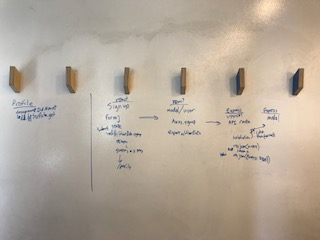

# PROJECT WAYFARER

Project Wayfarer is a travel community built for users to share tips / posts about their favorite locations around the world.

**API Documentation**

![Project Wire Frames] (src/img/wireframes.png)

![Development process on Trello] (https://trello.com/b/oYdvZqV3/wayfarer-trello)

![Live Version] (https://wayfare-front-345.herokuapp.com/)

**Technologies Used**

- HTML CSS
- JQuery
- NodeJS
- Express
- MongoDB
- Body Parser
- Materialize
- React
- Git
- Auth
- Heroku

**Existing Features**

Users has the ability to
- Create / update profile
- Create / update posts
- View posts by other users

**Nice Things**

- Pair Programming && Switching tasks
- Cookies 🍪
- Modals for days
- New posts show up instantly on top
- Seed posts are random
- Seed password cheat
- Logout link only when logged in
- Profile inaccessable when logged out
- Backend validation
- New Post fills username and city and disabled input
- You can't post if you are not logged in

**The Gauntlet**
- The one task and kept coming back over and over again

React Component <-> React Model (Axios) <-> Express API <-> Express DB

